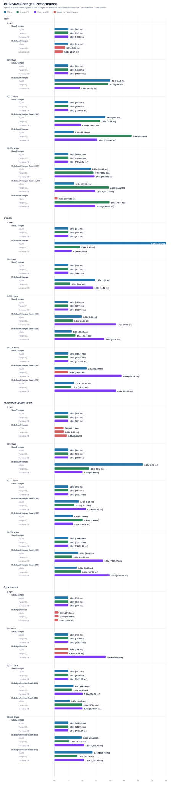

# EF Simple Bulk Save Changes

Small EF Core utilities for reducing database round trips and improving entity framework insert and update performance without adopting a large bulk library. The focus is simple PostgreSQL/CockroachDB-friendly SQL without `MERGE`, temp tables, or CTE-heavy tricks.

## Quick Start

There is no nuget package, instead copy the files from `EfSimpleBulkSaveChanges/` into your app or shared library:

## Available Utilities

### Example

`BulkSaveChangesAsync()` is a drop-in replacement for `SaveChanges()` and works by plugging into entity frameworks tracked changes (`Added`, `Modified`, and `Deleted` entities).

```csharp
using EfSimpleBulkSaveChanges;

using var dbContext = new AppDbContext();

// 1. Create your list of entities
var newUsers = new List<User>
{
    new User { Name = "Alice", Email = "alice@example.com" },
    new User { Name = "Bob", Email = "bob@example.com" },
    ...
};

// 2. Add the list to the DbContext
dbContext.Users.AddRange(newUsers);

// 3. Save changes to the database using BulkSaveChangesAsync() instead of SaveChanges()
// dbContext.SaveChanges();
await dbContext.BulkSaveChangesAsync();
```

## Example Entity

The SQL examples below assume:

```csharp
public sealed class User
{
    public long Id { get; set; }
    public required string FirstName { get; set; }
    public required string LastName { get; set; }
    public string? Email { get; set; }
    public int TenantId { get; set; }
}
```

## SQL Shape

Entity Framework usually emits one database command per tracked row, while this library batches rows into a single insert or update command for all rows.

### Insert

```csharp
dbContext.Users.AddRange(
    new User { FirstName = "John", LastName = "Doe", Email = "john.doe@example.com", TenantId = 1 },
    new User { FirstName = "Jane", LastName = "Smith", Email = "jane.smith@example.com", TenantId = 1 }
);
```

Typical Entity Framework `SaveChangesAsync()` would result in the following SQL:

```sql
INSERT INTO "users" ("email", "first_name", "last_name", "tenant_id")
VALUES (@p0, @p1, @p2, @p3)
RETURNING "id";

INSERT INTO "users" ("email", "first_name", "last_name", "tenant_id")
VALUES (@p4, @p5, @p6, @p7)
RETURNING "id";
```

`BulkSaveChangesAsync()` results in the following SQL:

```sql
INSERT INTO "users" ("email", "first_name", "last_name", "tenant_id")
VALUES (@p0, @p1, @p2, @p3), (@p4, @p5, @p6, @p7)
RETURNING "id";
```

### Update

```csharp
users[0].FirstName = "Johnny";
users[1].Email = "jane.updated@example.com";
```

Typical Entity Framework `SaveChangesAsync()` would result in the following SQL:

```sql
UPDATE "users"
SET "first_name" = @p0
WHERE "id" = @p1;

UPDATE "users"
SET "email" = @p2
WHERE "id" = @p3;
```

`BulkSaveChangesAsync()` results in the following SQL:

```sql
WITH source("id", "email", "first_name", "last_name", "tenant_id") AS (
  VALUES (@p0, @p1, @p2, @p3, @p4), (@p5, @p6, @p7, @p8, @p9)
)
UPDATE "users" AS target SET
  "email" = source."email",
  "first_name" = source."first_name",
  "last_name" = source."last_name",
  "tenant_id" = source."tenant_id"
FROM source
WHERE target."id" = source."id";
```

### Delete

```csharp
db.Users.RemoveRange(usersToDelete);
```

Typical Entity Framework `SaveChangesAsync()` would result in the following SQL:

```sql
DELETE FROM "users"
WHERE "id" = @p0;

DELETE FROM "users"
WHERE "id" = @p1;
```

`BulkSaveChangesAsync()` results in the following SQL:

```sql
DELETE FROM "users" WHERE "id" IN (@p0, @p1);
```

## Support

Supported:

- Relational EF Core providers
- Single-column non-shadow primary keys
- Normal scalar mapped properties
- Tracked `Added`, `Modified`, and `Deleted` entries
- Database-generated keys on insert via `RETURNING`

Not supported:

- Non-relational providers
- Composite keys
- Owned entity types
- Inheritance mappings
- Concurrency tokens
- Shadow primary keys
- Entities not mapped to a table

## Testing

```powershell
dotnet test
```

The tests assert generated SQL and parameter values without requiring a running PostgreSQL or CockroachDB instance.

## SQLite, PostgreSQL, and CockroachDB Performance Results



All tests performned on a development machine
SQLite: using in-memory databases
PostgreSQL: Docker v16 container
CockroachDB: Docker v26.2.1 single-node cluster

Timing are medidan of 3 runs

### Insert

| Rows | Method | Batch Size | SQLite ms | SQLite speedup | PostgreSQL ms | PostgreSQL speedup | CockroachDB ms | CockroachDB speedup |
| ---: | --- | ---: | ---: | ---: | ---: | ---: | ---: | ---: |
| 1 | SaveChanges |  | 0.15 | 1x | 1.40 | 1x | 4.40 | 1x |
| 1 | BulkSaveChanges | 100 | 0.18 | 0.83x | 2.13 | 0.66x | 11.35 | 0.39x |
| 100 | SaveChanges |  | 1.93 | 1x | 4.28 | 1x | 26.35 | 1x |
| 100 | BulkSaveChanges | 100 | 0.81 | 2.38x | 2.29 | 1.87x | 5.65 | 4.67x |
| 1,000 | SaveChanges |  | 19.50 | 1x | 24.79 | 1x | 166.62 | 1x |
| 1,000 | BulkSaveChanges | 100 | 6.45 | 3.02x | 11.12 | 2.23x | 24.05 | 6.93x |
| 1,000 | BulkSaveChanges | 1,000 | 21.46 | 0.91x | 9.04 | 2.74x | 15.19 | 10.97x |
| 10,000 | SaveChanges |  | 228.19 | 1x | 289.32 | 1x | 1,666.62 | 1x |
| 10,000 | BulkSaveChanges | 100 | 85.89 | 2.66x | 119.88 | 2.41x | 191.65 | 8.70x |
| 10,000 | BulkSaveChanges | 1,000 | 210.25 | 1.09x | 72.82 | 3.97x | 128.51 | 12.97x |
| 10,000 | BulkSaveChanges | 10,000 | 1,711.39 | 0.13x | 61.77 | 4.68x | 119.40 | 13.96x |

### Update

| Rows | Method | Batch Size | SQLite ms | SQLite speedup | PostgreSQL ms | PostgreSQL speedup | CockroachDB ms | CockroachDB speedup |
| ---: | --- | ---: | ---: | ---: | ---: | ---: | ---: | ---: |
| 1 | SaveChanges |  | 1.06 | 1x | 1.08 | 1x | 2.30 | 1x |
| 1 | BulkSaveChanges | 100 | 0.27 | 3.92x | 1.16 | 0.92x | 3.16 | 0.73x |
| 100 | SaveChanges |  | 1.09 | 1x | 3.53 | 1x | 31.64 | 1x |
| 100 | BulkSaveChanges | 100 | 0.92 | 1.19x | 10.13 | 0.35x | 4.44 | 7.13x |
| 1,000 | SaveChanges |  | 12.46 | 1x | 27.10 | 1x | 284.47 | 1x |
| 1,000 | BulkSaveChanges | 100 | 7.50 | 1.66x | 12.32 | 2.20x | 32.30 | 8.81x |
| 1,000 | BulkSaveChanges | 250 | 12.04 | 1.03x | 12.39 | 2.19x | 27.04 | 10.52x |
| 1,000 | BulkSaveChanges | 1,000 |  |  |  |  | 20.03 | 14.20x |
| 1,000 | BulkSaveChanges | 5,000 |  |  |  |  | 18.54 | 15.35x |
| 10,000 | SaveChanges |  | 155.58 | 1x | 281.13 | 1x | 2,803.88 | 1x |
| 10,000 | BulkSaveChanges | 100 | 79.77 | 1.95x | 174.28 | 1.61x | 254.62 | 11.01x |
| 10,000 | BulkSaveChanges | 250 | 156.62 | 0.99x | 114.87 | 2.45x | 238.92 | 11.74x |
| 10,000 | BulkSaveChanges | 1,000 |  |  |  |  | 188.79 | 14.85x |
| 10,000 | BulkSaveChanges | 5,000 |  |  |  |  | 182.94 | 15.33x |

### Mixed Add/Update/Delete

| Rows | Method | Batch Size | SQLite ms | SQLite speedup | PostgreSQL ms | PostgreSQL speedup | CockroachDB ms | CockroachDB speedup |
| ---: | --- | ---: | ---: | ---: | ---: | ---: | ---: | ---: |
| 1 | SaveChanges |  | 0.10 | 1x | 0.97 | 1x | 2.09 | 1x |
| 1 | BulkSaveChanges | 100 | 0.12 | 0.86x | 1.19 | 0.81x | 2.57 | 0.81x |
| 100 | SaveChanges |  | 1.55 | 1x | 3.64 | 1x | 23.93 | 1x |
| 100 | BulkSaveChanges | 100 | 0.46 | 3.39x | 2.66 | 1.37x | 5.56 | 4.31x |
| 1,000 | SaveChanges |  | 9.74 | 1x | 24.77 | 1x | 195.57 | 1x |
| 1,000 | BulkSaveChanges | 100 | 4.74 | 2.05x | 10.94 | 2.26x | 21.60 | 9.06x |
| 1,000 | BulkSaveChanges | 250 | 11.84 | 0.82x | 8.39 | 2.95x | 18.83 | 10.39x |
| 1,000 | BulkSaveChanges | 1,000 |  |  |  |  | 18.62 | 10.50x |
| 1,000 | BulkSaveChanges | 5,000 |  |  |  |  | 17.52 | 11.16x |
| 10,000 | SaveChanges |  | 144.87 | 1x | 247.34 | 1x | 1,990.03 | 1x |
| 10,000 | BulkSaveChanges | 100 | 55.18 | 2.63x | 126.95 | 1.95x | 199.61 | 9.97x |
| 10,000 | BulkSaveChanges | 250 | 74.83 | 1.94x | 124.73 | 1.98x | 177.85 | 11.19x |
| 10,000 | BulkSaveChanges | 1,000 |  |  |  |  | 145.64 | 13.66x |
| 10,000 | BulkSaveChanges | 5,000 |  |  |  |  | 124.82 | 15.94x |

